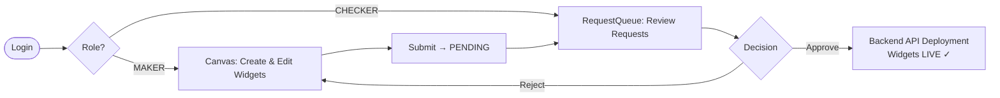
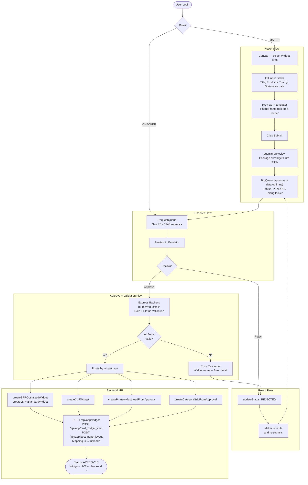

# Backend Work Flow — End-to-End Widget Lifecycle

## 1. Overview

Yeh document pura backend workflow describe karta hai — jab se **user UI mein aata hai** aur widget create karta hai, tab se lekar **approval aur backend deployment** tak ka complete flow.

```
User → UI (Canvas) → Widget Form Fill → Emulator Preview → Submit
    → Backend JSON Validation → Approval Queue → Checker Review
    → Approve / Reject → Backend API Deployment
```

### Role-Based Dashboard Skeleton

```
┌──────────────────────────────────────────────────────────┐
│  OPTIMUS                                  [👤 John Doe]   │
│  ░░░░░ DRAFT                              [Submit]        │
├──────────────────────────────────────────────────────────┤
│  Sidebar (Maker)              │  Canvas (Center)           │
│  ───────────────────────────  │  ──────────────────────── │
│  [🔍 Fetch: slug_name  ]      │  ┌─────────────────────┐  │
│                               │  │ Single Product Row   │  │
│  Widget Library               │  │  Rice Mela ···       │  │
│  ┌─ Product Rail ──────────┐  │  ├─────────────────────┤  │
│  │  [+ Add Widget]         │  │  │ Collection Banner    │  │
│  └─────────────────────────┘  │  │  Summer Sale ···     │  │
│  ┌─ Collection Banner──────┐  │  ├─────────────────────┤  │
│  │  [+ Add Widget]         │  │  │ Primary Masthead     │  │
│  └─────────────────────────┘  │  │  Diwali ···          │  │
│  ┌─ Masthead ──────────────┐  │  └─────────────────────┘  │
│  │  [+ Add Widget]         │  │                           │
│  └─────────────────────────┘  │  Right → Phone Emulator   │
└──────────────────────────────────────────────────────────┘

CHECKER VIEW (RequestQueue):
┌──────────────────────────────────────────────────────────┐
│  Review Queue                              [Filter: All ▼] │
│                                                            │
│  ▓▓ PENDING   John Doe         2 min ago                  │
│  ┌────────────────────────────────────────────────────┐   │
│  │ [☑] Rice Mela (Single Product Row)                 │   │
│  │ [☑] Diwali Masthead (Primary Masthead)             │   │
│  │ [☐] Summer Sale (Collection Banner)                │   │
│  │                                                    │   │
│  │  [Preview]         [✓ Approve]     [✕ Reject]     │   │
│  └────────────────────────────────────────────────────┘   │
│                                                            │
│  ██ APPROVED  Jane Smith       1 hour ago  [Deploy]        │
└──────────────────────────────────────────────────────────┘
```

### End-to-End Flow Overview



---

## 2. Full Flow — Step by Step

### Step 1 — User UI Mein Aata Hai

User Optimus tool open karta hai aur login karta hai.

- **Role resolve** hoti hai login pe: `MAKER`, `CHECKER`, ya `SUPER_ADMIN`
- MAKER ko canvas dikhta hai jahan widgets create kiye ja sakte hain
- CHECKER ko `RequestQueue` dikhta hai — pending approvals ke liye

```
┌─────────────────────────────────────────┐
│  OPTIMUS                    [👤 Login]   │
│                                         │
│  Left Sidebar     │  Canvas (Center)    │
│  ─────────────    │  ─────────────────  │
│  Widget Types ▼   │  (empty canvas)     │
│  [Select Type]    │                     │
│  [+ Add Widget]   │                     │
│                   │  Right → Emulator   │
└─────────────────────────────────────────┘
```

---

### Step 2 — Widget Type Select Karna

User sidebar mein widget type choose karta hai:

| Widget Type | Backend Type Resolved |
| :--- | :--- |
| Single Product Row | `single_product_row` |
| Single Product Row (Optimized) | `single_product_row_v2` |
| Multimedia Single Product Row | `multimedia_single_product_row` |
| Multimedia Single Product Row (Optimized) | `multimedia_single_product_row_v2` |
| Double Product Row | `double_product_row` |
| Double Product Row (Optimized) | `double_product_row_v2` |
| Multimedia Double Product Row | `multimedia_double_product_row` | **NOT AVAILABLE** |
| Multimedia Double Product Row (Optimized) | `multimedia_double_product_row_v2` |
| Collection Banner (Scroll) | `carousel` |
| Collection Banner (Stick) | `category` |
| Primary Masthead | `masthead_primary` |
| Secondary Masthead | `masthead_secondary_category_hp` |

> See [Feature-Creation-Widget.md](./Feature-Creation-Widget.md) for full variant matrix.

---

### Step 3 — Input Fields Fill Karna

Widget add karne ke baad, **Property Editor** (right sidebar) open hota hai. User saare required fields fill karta hai.

**Common Fields (sabhi widgets):**
```
┌──────────────────────────────────────────┐
│  Title (EN):   [______________________]  │
│  Title (HI):   [______________________]  │
│  Start Time:   [2026-02-19 10:00:00]     │
│  End Time:     [2026-07-01 18:00:00]     │
└──────────────────────────────────────────┘
```

**Widget-Specific Fields** (example: Product Rail):
```
┌──────────────────────────────────────────┐
│  Rows:       ○ Single    ○ Double        │
│  ☐ Optimized (V2)                        │
│  ☐ Multimedia Background                 │
│                                          │
│  Product Codes: [1001, 1002, 1003____]   │
│                                          │
│  ─── State-Wise (if Optimized) ───────   │
│  Global:     [1001, 1002, 1003_______]   │
│  Jharkhand:  [1003, 1004, 1005_______]   │
│  [ + Add State ]                         │
└──────────────────────────────────────────┘
```

All input fields config-driven hain — `WidgetRegistry.js` → `ProductRailConfig.js` etc. se aate hain.

> **Dynamic Validation:** Some fields have conditional `required` — e.g. Product Rail title is only required when `has_multimedia=false`. The `ConfigValidator.validateField()` supports `required` as a function `(pnc) => boolean`. State-wise products use `StateProductEditor` component — shows Global (required) + per-state inputs.

---

### Step 4 — Emulator Mein Preview

Input fields fill karne ke baad, widget **real-time emulator** mein dikhta hai (right panel — PhoneFrame).

```
┌─ Phone Emulator ──────────────────────┐
│                                        │
│  ┌────────────────────────────────┐   │
│  │  ★ Rice Mela Rail    View All  │   │
│  │  ┌─────┐ ┌─────┐ ┌─────┐      │   │
│  │  │ img │ │ img │ │ img │      │   │
│  │  │ ₹99 │ │₹149 │ │₹199 │      │   │
│  │  │Rice │ │Atta │ │Dal  │      │   │
│  │  └─────┘ └─────┘ └─────┘      │   │
│  └────────────────────────────────┘   │
│                                        │
└────────────────────────────────────────┘
```

Emulator sirf **visual preview** hai — backend mein kuch create nahi hota abhi tak.

---

### Step 4.1 — Widget Selection (Maker Submit)

Submit button click karne pe pehle ek **selection modal** khulta hai jismein Maker choose kar sakta hai konse widgets review ke liye bhejna hai.

```
Maker clicks "Submit"
    ↓
Selection Modal opens (all widgets pre-selected by default)
    ↓
┌─────────────────────────────────────────┐
│  Submit for Review                      │
│  Select widgets to send for approval    │
│                                         │
│  5 of 10 selected   [Select All | None] │
│                                         │
│  [✓] 🎯 Primary Masthead     HEADER    │  ← header widget (purple)
│  [✓] 🏷 Secondary Masthead   HEADER    │  ← header widget (purple)
│  ─────── Body Widgets ──────────────    │
│  [✓] Rice Mela          product_rail    │
│  [✓] Summer Sale         collection     │
│  [✓] New Widget          product_rail   │
│  [ ] Dairy & Breakfast   Category Grid  │  ← FETCHED — skip
│  [ ] Grocery             Category Grid  │  ← FETCHED — skip
│  ...                                    │
│                                         │
│  [Cancel]          [Submit 5 Widgets]   │
└─────────────────────────────────────────┘
```

**Config:** `WIDGET_SELECTION_CONFIG.maker` in `src/config/BackendFlow.js`
**State:** `submitSelection`, `showSubmitModal`, `openSubmitModal` in `src/context/WidgetContext.jsx`
**UI:** Selection modal in `src/components/Layout/MainLayout.jsx`

| Rule | Value |
|:---|:---|
| Default state | All widgets **selected** |
| Min selection | At least 1 widget must be selected |
| Shows FETCHED badge | Yes — fetched widgets pe green badge dikhta hai |
| Shows slug | Yes — har widget ka current slug code mein dikhta hai |

---

### Step 5 — Submit Karna (Maker)

Selection ke baad, Maker **"Submit N Widgets"** button click karta hai.

```
Maker clicks "Submit N Widgets" in selection modal
    ↓
WidgetContext.submitForReview(selectedWidgetIds) called
    ↓
ValidationService.validateAndCheckSlugs(selectedWidgets) — field-level validation
    ↓
Slug passed as-is (no uniqueness check — same slug goes to BigQuery)
    ↓
Only selected widgets packaged into JSON payload
    ↓
LocalApiService.createRequest() → Express backend → BigQuery (apna-mart-data.optimus)
    ↓
pageStatus → PENDING
    ↓
Canvas editing locked ✗
```

**Submit Payload (Express backend ko jaata hai — POST /api/local/requests):**

```json
{
    "action": "create",
    "id": "550e8400-e29b-41d4-a716-446655440000",
    "user": "john.doe@apnamart.in",
    "type": "Homepage Update",
    "status": "PENDING",
    "widgets": [
        {
            "type": "Single Product Row",
            "title": "Rice Mela",
            "slug": "rice_mela_spr_sc_rohp_global_allusers_both",
            "products": ["1001", "1002", "1003"],
            "startTime": "2026-02-19 10:00:00",
            "endTime": "2026-07-01 18:00:00"
        }
    ],
    "headerWidgets": {
        "primaryMasthead": { ... },
        "secondaryMasthead": { ... }
    }
}
```

---

### Step 6 — Backend JSON Validation

**Approve se pehle**, Express backend (`server/routes/requests.js`) widget ka JSON check karta hai — saare fields sahi hain ya nahi.

**Pre-Submit (Frontend):** `ValidationService.validateAndCheckSlugs()` validates:
- Required fields (slug, title, type)
- Slug uniqueness via `LocalApiService.getWidgets({ slug })`
- DateTime format (if present)
- Product list minimum (per widget type)

**On Approve (Backend):** `server/middleware/validate.js` re-validates:
```
Checker "Approve" click karta hai
    ↓
LocalApiService.approveRequest(id) → POST /api/local/requests/:id/approve
    ↓
Express: route handler validates role (CHECKER/SUPER_ADMIN only)
    ↓
Har widget ke liye validation:
    ┌─────────────────────────────────────────┐
    │  1. widget_type valid hai?              │
    │  2. Required fields present hain?       │
    │     - slug                              │
    │     - title (heading_en / text_en)      │
    │     - start_time / end_time             │
    │     - product_list (if applicable)      │
    │  3. Multimedia slug valid hai?          │
    │     (agar multimedia field empty nahi)  │
    └─────────────────────────────────────────┘
    ↓
Sab theek → DB status APPROVED, Widget status APPROVED
Koi galti → Error return, status PENDING rehta
```

**Validation Error Response (agar koi field galat hai):**

```json
{
    "success": false,
    "results": [
        {
            "widget": "Rice Mela",
            "status": "failed",
            "error": "Required field missing: product_list cannot be empty"
        },
        {
            "widget": "Primary Masthead",
            "status": "failed",
            "error": "Background Multimedia Name is invalid — omit field if empty"
        }
    ]
}
```

**Error UI Toast:**
```
┌─────────────────────────────────────────────────┐
│  ✗ Approval Failed                               │
│                                                   │
│  Widget: "Rice Mela"                             │
│  Error: product_list cannot be empty             │
│                                                   │
│  Widget: "Primary Masthead"                      │
│  Error: Background Multimedia Name is invalid    │
└─────────────────────────────────────────────────┘
```

Checker phir **Reject** kar sakta hai aur Maker ko batana padta hai kya fix karna hai.

---

### Step 7 — Checker Review (Approval Queue)

Checker **RequestQueue** mein jaata hai aur pending requests dekhta hai.

```
┌──────────────────────────────────────────────┐
│  Review Queue                    [Filter ▼]   │
│                                               │
│  ┌──────────────────────────────────────┐    │
│  │  John Doe              2 min ago     │    │
│  │  ● PENDING    3 Widgets              │    │
│  │                                      │    │
│  │  [✓] Single Product Row - Rice Mela  │    │
│  │  [✓] Category Grid - Grocery         │    │
│  │  [✓] Primary Masthead - Diwali       │    │
│  │                                      │    │
│  │  [Preview]   [Approve]   [Reject]    │    │
│  └──────────────────────────────────────┘    │
│                                               │
│  ┌──────────────────────────────────────┐    │
│  │  Jane Smith            1 hour ago    │    │
│  │  ✓ APPROVED   2 Widgets  [Deploy]    │    │
│  └──────────────────────────────────────┘    │
└──────────────────────────────────────────────┘
```

**Checker ke options:**

| Action | Tab se | Kya hota hai |
| :--- | :--- | :--- |
| **Preview** | PENDING | Canvas mein widgets restore, emulator mein dikhta hai |
| **Approve** | PENDING | Status APPROVED, automatically triggers deploy for CHECKER |
| **Reject** | PENDING | Status REJECTED, Maker re-edit kar sakta hai |
| **Re-open** | APPROVED | Status DRAFT, editing phir se open |
| **Deploy** | APPROVED | Push widgets to Django backend (auto-CSRF from session cookie) |
| **Approve & Deploy** | PENDING | One-click: approve in BigQuery + deploy to Django backend |

> **Auto-Deploy on Approve:** When CHECKER approves, deploy is automatically triggered — no separate Deploy step needed for CHECKER role.

---

### Step 7.1 — Widget Selection (Approve se Pehle)

Checker **approve karne se pehle** yeh decide karta hai ki kaun se widgets actually backend pe deploy hone chahiye. Yeh **partial approval** allow karta hai — ek hi submission mein se sirf kuch widgets approve ho sakte hain.

**Flow:**

```
Request card expand karo (Show Widgets ▼)
    ↓
Header Widgets aur Body Widgets alag-alag list mein dikhte hain
    ↓
Checkbox se select/deselect karo
    ↓
Minimum 1 widget select hona zaroori hai
    ↓
[Approve] → sirf selected widgets ke liye API calls honge
```

**Selection UI (expanded card view):**

```
┌── Request: John Doe — PENDING ──────────────────────────┐
│                                                           │
│  ▼ Hide Widgets                                           │
│                                                           │
│  ┌─── Header Widgets ────────────────────────────────┐  │
│  │  [☑] 🎨 Primary Masthead   "Diwali Campaign"      │  │  ← gradient bg
│  │  [☐] 🎨 Secondary Masthead "Category Carousel"    │  │  ← unchecked, dimmed
│  └───────────────────────────────────────────────────┘  │
│                                                           │
│  ┌─── Body Widgets ──────────────────────────────────┐  │
│  │  [☑]  Single Product Row   "Rice Mela"            │  │  ← checked, blue bg
│  │  [☐]  Category Grid        "Grocery"              │  │  ← unchecked, dimmed
│  │  [☑]  Single Product Row   "Atta Deals"           │  │  ← checked
│  └───────────────────────────────────────────────────┘  │
│                                                           │
│  [Preview]     [Approve]     [Reject]                     │
└───────────────────────────────────────────────────────────┘
```

**Widget Selection Rules:**

| Rule | Behaviour |
| :--- | :--- |
| Default state | All widgets **unchecked** — Checker must explicitly select |
| Min selection | **At least 1** widget must be selected to Approve |
| Header widgets | Primary Masthead aur Secondary Masthead separately selectable |
| Partial selection | Checker sirf 2 of 4 select kar sakta hai — baaki skip |
| Maker view | Checkboxes **not shown** — Maker sirf list dekh sakta hai (read-only) |

**Code reference:**

| State | Location | Description |
| :--- | :--- | :--- |
| `selectedWidgets` | `RequestQueue.jsx` | `Map<reqId → Set<widgetIndex>>` — body widget selections |
| `selectedHeaderWidgets` | `RequestQueue.jsx` | `Map<reqId → Set<'primaryMasthead'/'secondaryMasthead'>>` |
| `handleApprove()` | `RequestQueue.jsx` | Filters `req.widgets[]` + `req.headerWidgets{}` by selection before passing to `LocalApiService.approveRequest()` |

**Why partial selection?**

Ek maker ek saath multiple widgets submit karta hai — kuch ready hoti hain, kuch mein abhi issues hain. Checker sirf ready wali approve kar sakta hai, baaki PENDING mein rehti hain ya reject hoti hain.

---


### Step 8 — Approve: Backend API Deployment

Checker approve karta hai → Express backend (`server/routes/requests.js`) status update karta hai:

```javascript
// POST /api/local/requests/:id/approve
// 1. Validates role (CHECKER/SUPER_ADMIN only)
// 2. Checks request status is PENDING
// 3. Optional: approve only selectedWidgetIds
// 4. Updates Request.status → APPROVED
// 5. Updates Widget.status → APPROVED for all selected widgets
// 6. Logs ActivityLog entry (action: 'approve')
```

**Backend API Calls (example: Product Rail Standard):**

```
0. POST /api/app/multimedia/           → Multimedia upload (only if has_multimedia=true)
1. POST /api/app/post_page_layout/     → Page Layout create
2. POST /api/app/post_widget_item/     → Widget Item create (products)
3. POST /api/app/widget/               → Homepage Widget create
4. Mapping CSV upload (postMapping)    → Widget Item → Widget link
5. Mapping CSV upload (postMapping)    → Widget → Page Layout link
6. Mapping CSV upload (postMapping)    → Page → Global registry link
```

**Backend API Calls (example: Product Rail Optimized — with state-wise):**

```
0. POST /api/app/multimedia/           → Multimedia upload (only if has_multimedia=true)
1. POST /api/app/post_page_layout/     → Page Layout create
2. POST /api/app/post_widget_item/     → Sub-Category Item (global) create
3. POST /api/app/post_widget_item/     → Sub-Category Item (jharkhand) create  ← per-state
4. POST /api/app/post_widget_item/     → Sub-Category Item (chhattisgarh) create
5. POST /api/app/widget/               → PLP Ecosystem Widget create
6. Mapping CSV (postMapping)           → Sub-Cat Items → PLP Widget (state-wise)
7. POST /api/app/post_widget_item/     → Product Row Item create
8. POST /api/app/widget/               → Homepage SPR Widget create
9. Mapping CSV (postMapping)           → Row Item → SPR Widget link
10. Mapping CSV (postMapping)          → SPR Widget → Page Layout link
11. Mapping CSV (postMapping)          → Page → Global registry link (page_type=product_listing_page)
```

> **Step 0 — Multimedia Upload:** Only runs when `has_multimedia=true` AND `background_media` is a File object. Returns a slug used as `background_multimedia` in the widget payload. If no multimedia, the `background_multimedia` field is **omitted entirely** (empty string causes Django 400 error).

> **State-wise Sub-Category Items:** When `stateProducts` has multiple keys (e.g. `{ global: '...', jharkhand: '...', chhattisgarh: '...' }`), a separate sub-category widget item is created per state, and the mapping CSV includes location-wise rows (`state/jharkhand`, `state/chhattisgarh`, etc.).

> **postMapping() Helper:** All CSV mapping calls use a dedicated `postMapping()` function — no `csrfmiddlewaretoken` in the form body (only `X-CSRFToken` header), and `Blob` + 3-arg `FormData.append('mapping_file', blob, 'mapping.csv')`. See `src/services/BackendSyncService.js`.

**Success Response:**

```json
{
    "success": true,
    "message": "Processed 3 widgets",
    "results": [
        {
            "widget": "Rice Mela",
            "status": "success",
            "slug": "rice_mela_spr"
        },
        {
            "widget": "Grocery Grid",
            "status": "success",
            "slug": "grocery_cm_hp"
        },
        {
            "widget": "Diwali Masthead",
            "status": "success",
            "slug": "diwali_pm_hp"
        }
    ],
    "errors": []
}
```

---

### Step 9 — Reject Flow

Agar Checker reject karta hai (ya validation fail hoti hai):

```
Checker "Reject" click karta hai
    ↓
LocalApiService.rejectRequest(id, reason) → POST /api/local/requests/:id/reject
    ↓
Express: Request.status → REJECTED, Widget.status → REJECTED
    ↓
RejectionReason stored in Request.rejectionReason
    ↓
Maker ko editing access wapas milti hai
    ↓
Maker fields fix karta hai
    ↓
Maker phir se "Submit" karta hai → PENDING
    ↓
Checker phir review karta hai
```

---

## 3. Complete End-to-End Flow Diagram



---

## 4. Status Lifecycle

```
          submitForReview()
DRAFT ────────────────────→ PENDING
  ↑                            │
  │ resetToDraft()    ┌────────┴────────┐
  │                   │                 │
  │              approvePage()     rejectPage()
  │                   │                 │
  │                   ↓                 ↓
  │               APPROVED          REJECTED
  │                   │                 │
  │           [Deploy available]   Maker re-edits
  └─────────────────────────────────────┘
```

| Status | Maker Kar Sakta Hai | Checker Kar Sakta Hai |
| :--- | :--- | :--- |
| `DRAFT` | Create, Edit, Delete, Submit | Preview only |
| `PENDING` | Sirf dekh sakta, edit nahi | Preview, Approve, Reject |
| `APPROVED` | Kuch nahi | Re-open, Deploy |
| `REJECTED` | Edit, Re-submit | Preview |

---

## 5. Error Reference — Common Validation Failures

| Error | Widget | Cause | Fix |
| :--- | :--- | :--- | :--- |
| `product_list cannot be empty` | Product Rail | Products add nahi kiye | Product codes daalo |
| `Background Multimedia Name is invalid` | Masthead / SPR Multimedia | `background_multimedia` field empty string bheja | Multimedia field blank rakhne pe field hi mat bhejo |
| `slug_name already exists` | Any | Wahi slug already backend pe exist karta hai | Naya unique slug use karo |
| `start_time format invalid` | Any | Date format galat hai | `YYYY-MM-DD HH:MM:SS` format use karo |
| `Type not supported` | Any | Widget type backend mein register nahi | BackendFlow.js mein naya routing add karo |
| `Session expired (403)` | Any | Auth session expire ho gayi | Re-login karo |
| `Sub-category items missing` | Optimized SPR / CLP | State-wise items nahi banaye | Saare states ke items create karo |
| `Mapping CSV upload failed` | Any (Layer 1/2/3) | `csrfmiddlewaretoken` in form body ya wrong FormData format | `postMapping()` helper use karo — no token in body, Blob+3-arg append |
| `page_type empty in Layer 3` | SPR Optimized | Layer 3 mapping CSV mein `page_type` empty string | `page_type: 'product_listing_page'` set karo |

---

## 6. Key Components Reference

| Component | File | Role |
| :--- | :--- | :--- |
| **WidgetLibrary** | `src/components/Sidebar/WidgetLibrary.jsx` | Widget type selector + "Add" button |
| **PropertyEditor** | `src/components/Sidebar/PropertyEditor.jsx` | Input fields (config-driven) |
| **PhoneFrame / Emulator** | `src/components/Layout/MainLayout.jsx` | Real-time visual preview |
| **WidgetContext** | `src/context/WidgetContext.jsx` | State, submit, approve, reject logic |
| **LocalApiService** | `src/services/LocalApiService.js` | Express backend CRUD — widgets, requests, users, catalog |
| **Express Backend** | `server/routes/requests.js` | Approval routing + status updates |
| **BigQuery Schema** | `server/services/BigQueryService.js` | Database tables in `apna-mart-data.optimus` (canvas_widgets, submissions, widget_versions, user_roles, locations). Widget has `env` field (UAT/PROD). |
| **BackendSyncService** | `src/services/BackendSyncService.js` | Deploy to Django — `postForm`, `postMapping`, `uploadMultimedia`, per-widget deploy functions |
| **AuthContext** | `src/context/AuthContext.jsx` | Role management (MAKER/CHECKER) |
| **RequestQueue** | `src/components/Dashboard/RequestQueue.jsx` | Checker review UI |
| **WidgetRegistry** | `src/config/WidgetRegistry.js` | Widget config lookup + BackendFlow integration |
| **BackendFlow** | `src/config/BackendFlow.js` | Workflow stages, roles, validation, routing config |

---

## 7. Config File — `src/config/BackendFlow.js`

Yeh file poore backend workflow ka **config source of truth** hai. `WidgetRegistry.js` isey import karta hai aur apne methods mein expose karta hai.

### Exports

| Export | Type | Kya hai |
| :--- | :--- | :--- |
| `WORKFLOW_STAGES` | Object | `DRAFT`, `PENDING`, `APPROVED`, `REJECTED` — har stage ka description, allowed roles, aur valid next transitions |
| `ROLE_PERMISSIONS` | Object | Har role (`MAKER`, `CHECKER`, `SUPER_ADMIN`) ke liye allowed actions (canSubmit, canApprove, canReject...) |
| `SUBMIT_PAYLOAD_SCHEMA` | Object | Express backend ko bheje jaane wale payload ka schema |
| `VALIDATION_RULES` | Object | Universal + per-type validation rules (field, rule, error message) |
| `APPROVAL_ROUTING` | Object | Canvas widget type → backend approval handler mapping |
| `BACKEND_ENDPOINTS` | Object | Saare backend REST endpoints (`/api/local/widgets`, `/api/local/requests` etc.) |
| `APPROVAL_RESPONSE_SCHEMA` | Object | Approval response ka expected shape |
| `FETCHED_WIDGET_MARKERS` | Object | `_fetched: true`, `slug`, `_rawData` — fetched widget identifiers |
| `ERROR_CATALOGUE` | Array | Known validation errors — cause + fix for each |
| `WORKFLOW_SUMMARY` | Object | Name, version, wikiRef, stages list, roles list |

### WidgetRegistry Methods (BackendFlow se powered)

Yeh methods `WidgetRegistry.js` mein add hue hain — `BackendFlow.js` ke data pe based:

```javascript
// Poora workflow config ek hi call mein:
WidgetRegistry.getWorkflowConfig()
// → { stages, roles, validation, routing, endpoints, errors, summary }

// Role + status ke hisaab se allowed actions:
WidgetRegistry.getAllowedActions('MAKER', 'DRAFT')
// → ['canCreate', 'canEdit', 'canDelete', 'canSubmit']

// Canvas widget type → backend approval handler:
WidgetRegistry.getApprovalRoute('Single Product Row Optimize')
// → { fn: 'createSPROptimizedWidget', description: '...' }

// Universal + type-specific validation rules:
WidgetRegistry.getValidationRules('Single Product Row')
// → [{ field: 'type', rule: 'required', ... }, { field: 'products', rule: 'minItems:1', ... }]
```

### Import Pattern

```javascript
// Option A — via WidgetRegistry (recommended)
import { WidgetRegistry } from 'src/config/WidgetRegistry';
const { stages, roles } = WidgetRegistry.getWorkflowConfig();

// Option B — direct named imports (re-exported from WidgetRegistry)
import { WORKFLOW_STAGES, APPROVAL_ROUTING } from 'src/config/WidgetRegistry';

// Option C — direct from BackendFlow (if WidgetRegistry not needed)
import { VALIDATION_RULES, ERROR_CATALOGUE } from 'src/config/BackendFlow';
```

---

## 8. Related Documentation

- [Feature-Creation-Widget.md](./Feature-Creation-Widget.md) — Har widget ke creation steps aur API payloads
- [Feature-Maker-Checker.md](./Feature-Maker-Checker.md) — Approval workflow detail (roles, states, sheet)
- [Feature-Mapping-Widget.md](./Feature-Mapping-Widget.md) — Mapping types aur CSV formats
- [FEATURE-Fetch-Widget.md](./FEATURE-Fetch-Widget.md) — Existing widgets fetch, edit, re-submit
- [PLP-PAGE-widget-support.md](./PLP-PAGE-widget-support.md) — 3-layer PLP ecosystem
- [Product Rail (SPR + DPR)](./Widget-spr.md) — Product Rail variants
- [WIDGET-Collection-Banner.md](./WIDGET-Collection-Banner.md) — Carousel + Category Grid
- [WIDGET-Masthead.md](./WIDGET-Masthead.md) — Primary aur Secondary Masthead

---

## 9. Reliability Improvements

Feb 2026 mein implement kiye gaye 9 reliability features. Yeh all production-critical flows ko robust banate hain.

---

### 9.1 Session Auto-Refresh (403 Recovery)

**Files:** `src/services/withSessionRetry.js`, `src/config/BackendFlow.js` → `SESSION_CONFIG`

Jab bhi koi API call 403 return kare (expired CSRF session), `fetchWithSessionRetry()` automatically `GET /login/` call karta hai ta ke fresh CSRF cookie mil sake, aur phir original request retry karta hai.

```
API Call → 403 Received → GET /login/ (refresh CSRF cookie) → Retry → Success ✅
                                                                ↓ max 2 retries
                                                             → Still 403 → Re-login needed
```

**Config:** `SESSION_CONFIG.maxRetryOn403 = 2`, `SESSION_CONFIG.refreshEndpoint = '/login/'`

---

### 9.2 Pre-Submit Frontend Validation

**Files:** `src/services/ValidationService.js` → `validateWidgets()`, `src/context/WidgetContext.jsx` → `submitForReview()`

Submit button dabane se pehle, `validateAndCheckSlugs()` saare widgets validate karta hai `WidgetRegistry.getValidationRules()` se. Koi bhi validation fail hone par submit block hota hai aur toast error dikhta hai.

**Validations run:** required fields, minItems, minLength, datetime format, slug_name presence.

---

### 9.3 API Retry Logic (Exponential Backoff)

**Files:** `src/services/BackendSyncService.js` → `fetchWithRetry()`, `src/config/BackendFlow.js` → `RETRY_CONFIG`

Backend API calls (widget create/update) automatically retry on 5xx responses with exponential backoff.

```
HTTP 500/502/503/504  →  Wait 500ms  →  Retry
                      →  Wait 1000ms →  Retry
                      →  Wait 2000ms →  Final attempt
```

**Config:** `RETRY_CONFIG.maxRetries = 3`, `RETRY_CONFIG.baseDelayMs = 500`, `RETRY_CONFIG.backoffMultiplier = 2`

---

### 9.4 Slug Handling — Direct Pass-Through

**Files:** `src/services/ValidationService.js` → `validateAndCheckSlugs()`

Slug ko as-is pass kiya jaata hai — **no uniqueness check, no auto-increment**. Jo slug SlugBuilder se create hota hai, wahi directly BigQuery mein store hota hai.

**Validation:** Sirf required field check — slug empty nahi hona chahiye.

```
SlugBuilder composes: "rice_mela_spr_sc_rohp_global"
    ↓
Same slug → widget.slug = "rice_mela_spr_sc_rohp_global"
    ↓
Submit → same slug in request payload
    ↓
BigQuery stores: slug = "rice_mela_spr_sc_rohp_global"
```

> **Note:** Fetched widgets (`_fetched: true`) already have their backend slug preserved via `ApiMapper.js`.

---

### 9.5 Partial Deployment Status

**Files:** `src/services/BackendSyncService.js` → `deployRequest()`, `src/components/Dashboard/RequestQueue.jsx`

`deployRequest()` ab per-widget `results[]` return karta hai: `ok`, `updated`, `skipped`, ya `failed`. RequestQueue mein deployment ke baad har widget ka status icon ke saath dikhta hai.

```
Widget 1 — ✅ ok
Widget 2 — ✅ updated (fetched widget re-deployed)
Widget 3 — ❌ failed: PATCH failed for xyz: HTTP 404
Widget 4 — ⏳ skipped (unsupported type)
```

---

### 9.6 Fetched Widget Re-Deploy (PATCH Flow)

**Files:** `src/services/BackendSyncService.js` → `updateWidget()`, `src/config/BackendFlow.js` → `FETCHED_WIDGET_UPDATE_STRATEGY`

Agar canvas pe koi fetched widget ho (`_fetched: true`), `deployRequest()` usse `PATCH /api/app/widget/<slug>/` se update karta hai, naya `POST` nahi karta.

> **Fallback:** Agar backend `PATCH` support na kare (405), quietly skip karta hai aur log karta hai.

See also: [FEATURE-Fetch-Widget.md](./FEATURE-Fetch-Widget.md)

---

### 9.7 UAT Environment Badge

**Files:** `src/components/Layout/MainLayout.jsx`

Jab `VITE_ENV=UAT` ho, header mein logo ke paas orange pulsing **🧪 UAT** badge dikhta hai. Production mein kuch nahi dikhta.

```jsx
{ACTIVE_ENV === 'UAT' && (
    <span className="... animate-pulse">🧪 UAT</span>
)}
```

---

### 9.8 Widget Environment Separation (UAT/PROD Data Isolation)

**Files:** `server/services/BigQueryService.js`, `server/routes/widgets.js`, `server/middleware/auth.js`

Widget model mein `env` field add kiya gaya hai (`UAT` | `PROD`, default `PROD`). Ab same slug dono environments mein allow hai — unique constraint `@@unique([slug, env])` hai.

**Backend routes updated:**
- `GET /widgets` — `where.env = req.env` filter lagta hai, sirf current env ke widgets return hote hain
- `POST /widgets` — `env: req.env` store hota hai creation pe
- `POST /:id/duplicate` — `env: source.env` inherit hota hai source widget se

**Frontend auto-filtered:** `LocalApiService` already har request pe `X-Optimus-Env` header bhejta hai (line 19). Auth middleware `req.env` set karta hai. Koi frontend change nahi — backend filtering se pura app automatically env-scoped ho gaya.

**HomepageMappingDashboard:** Ab PROD/UAT badge show karta hai title ke next — same style as MainLayout header badge.

```
Login UAT → Create Widget → Switch to PROD → Widget NOT visible ✓
Login PROD → Create Widget → Switch to UAT → Widget NOT visible ✓
```

---

### 9.9 Version History Preview + Pagination

**Files:** `src/components/Dashboard/WidgetVersionHistory.jsx`, `src/components/Dashboard/SnapshotPreview.jsx`, `server/routes/widgets.js`

Version History panel mein ab **Diff | Preview** tab switcher hai:
- **Diff tab** = existing JSON diff (unchanged)
- **Preview tab** = visual widget render from snapshot data (side-by-side: previous vs selected version)

`SnapshotPreview.jsx` component:
- Parsed snapshot → correct widget component render karta hai (SingleProductRow, CollectionBanner, etc.)
- Same componentMap as `WidgetRenderer.jsx`
- Stub `WidgetContext.Provider` wrap karta hai ta ke components crash na karein
- 360px wide container (phone width)

**Backend pagination:** `GET /widgets/:id/versions` ab `limit` + `cursor` support karta hai:
- Default: 20 versions per page, max 100
- Response: `{ versions: [...], hasMore: boolean, nextCursor: number | null }`
- Frontend: "Load older versions" button at bottom of timeline

**Memoization:** `React.memo` on `TimelineEntry`, `useMemo` on diff computation.

**History → Emulator Preview (Restore):**
- MainLayout toolbar mein "History" button click karne pe selected widget ka DB ID (`_dbId` or canvas `id`) aur slug pass hota hai `WidgetVersionHistory` ko
- Pehle hardcoded slug tha (`rice_mela_spr_opt`) — ab dynamic hai based on `selectedWidgetId`
- `onRestore` callback connected: snapshot → `updateWidget(canvasId, snapshot)` → PhoneFrame emulator mein widget instantly update hota hai
- Agar koi widget selected nahi hai to toast error: "Select a widget first to view its history"

---

### 9.10 Map to Page (Post-Deploy)

**Files:** `src/components/Dashboard/MapToPageModal.jsx` (NEW), `src/components/Dashboard/RequestQueue.jsx`

Deploy ke baad Checker ko "Map to Page" button dikhta hai (purple gradient). Click karne pe `MapToPageModal` open hota hai:
- Page Layout Slug input (default: `GL-HP-global` from HomepageMappingConfig)
- Deployed widget slugs with checkboxes (only `status === 'ok'` or `'updated'`)
- Per-widget: Level dropdown (global/state/city/store_id), Value input, Priority number
- Submit pe single batch CSV build hota hai aur `POST /api/app/update_layout_widget_mapping/` call

**API replaces all mappings** for the given `page_layout_slug`, so batching all selected widgets into one CSV is correct behavior.

**Visibility:** Sirf Checker (admin) ko dikhta hai — `!isMaker` guard.

---

### 9.11 Activity Log Persistence (Audit Trail)

**Files:** `src/context/ActivityLogContext.jsx`, `src/components/ActivityLogPanel.jsx`, `src/services/LocalApiService.js` → `appendActivity()`, `getActivity()`

Significant events (`page_submitted`, `page_approved`, `page_rejected`) automatically BigQuery (`apna-mart-data.optimus` activity_log table) mein persist hote hain. Minor widget edits sirf in-memory rehte hain.

ActivityLogPanel mein 🔄 button se past sessions ke persisted logs load kiye ja sakte hain.

**Google Sheet Action:** `audit_log` (append), `get_audit_log` (fetch)

---

### 9.11 Rejection Reason Dialog

**Files:** `src/components/Dashboard/RequestQueue.jsx`, `src/services/GoogleSheetService.js` → `updateStatus(id, status, rejectionReason)`

Checker jab **Reject** click kare, ek dialog open hota hai jahan optional rejection reason type kar sakte hain. Yeh reason:
1. Google Sheet mein `rejectionReason` column mein store hota hai
2. Maker ke RequestQueue view mein REJECTED card ke neeche dikhta hai

```
[Reject] → Dialog: "Enter reason..."
         → [Cancel] / [Confirm Reject]
         → updateStatus(id, 'REJECTED', reason)
         → Maker sees: "Rejection Reason: Product list is empty..."
```

